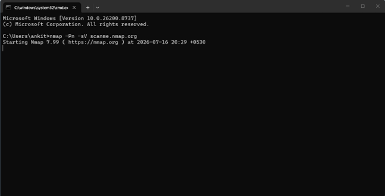
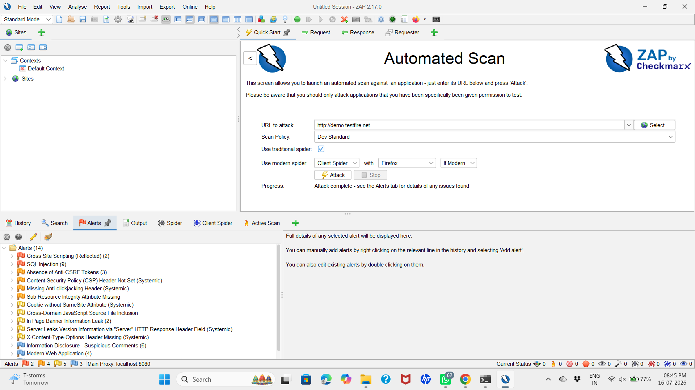
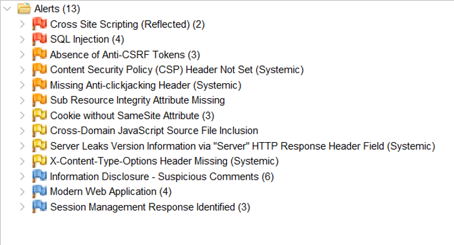
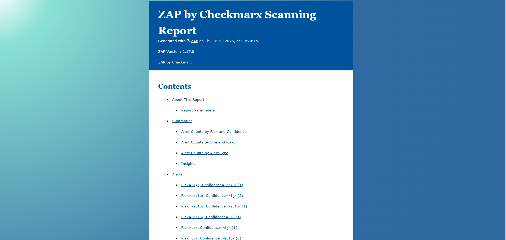

# FUTURE_CS_01 – Vulnerability Assessment Report for a Live Website

## Overview

This repository contains the submission for **Task 1** of the **Future Interns Cyber Security Internship**.

The objective of this task was to perform a **passive security assessment** on a publicly accessible demonstration web application using industry-standard cybersecurity tools. The assessment focused on identifying security weaknesses through non-destructive testing without exploiting vulnerabilities or affecting the application's normal operation.

---

## Project Information

| Category | Details |
|----------|---------|
| **Internship** | Future Interns – Cyber Security Internship |
| **Task** | Task 1 – Vulnerability Assessment Report |
| **Assessment Type** | Passive Web Application Security Assessment |
| **Target Application** | TestFire Demo Application (Altoro Mutual) |
| **Target URL** | http://demo.testfire.net |
| **Testing Approach** | Passive / Non-Destructive Testing |

---

## Objectives

The primary objectives of this assessment were to:

- Identify common web application security vulnerabilities.
- Perform passive reconnaissance using Nmap.
- Analyze HTTP requests and responses using OWASP ZAP.
- Categorize identified vulnerabilities according to their severity.
- Recommend appropriate mitigation techniques.
- Produce a professional vulnerability assessment report.

---

## Tools and Technologies

| Tool | Purpose |
|------|---------|
| **Nmap** | Network reconnaissance and service discovery |
| **OWASP ZAP** | Passive web application vulnerability assessment |
| **Browser Developer Tools** | Verification of requests, responses and security headers |
| **Google Chrome** | Target application testing |
| **Microsoft Word** | Report preparation |

---

## Assessment Methodology

The assessment was performed using the following workflow:

1. Target Identification
2. Network Reconnaissance
3. Passive Web Application Assessment
4. Manual Verification of Findings
5. Documentation and Reporting

The assessment strictly followed passive testing techniques and did not involve exploitation, brute-force attacks, denial-of-service testing, or any modification of application data.

---

## Summary of Findings

| Severity | Count |
|---------|------:|
| 🔴 High | **2** |
| 🟠 Medium | **4** |
| 🟡 Low | **4** |
| 🔵 Informational | **3** |

### High Severity

- Reflected Cross-Site Scripting (XSS)
- SQL Injection

### Medium Severity

- Absence of Anti-CSRF Tokens
- Content Security Policy (CSP) Header Not Set
- Missing Anti-Clickjacking Header
- Missing Subresource Integrity (SRI)

### Low Severity

- Cookie Without SameSite Attribute
- Cross-Domain JavaScript Source File Inclusion
- Server Version Information Disclosure
- Missing X-Content-Type-Options Header

### Informational

- Information Disclosure – Suspicious Comments
- Modern Web Application Detection
- Session Management Response Identified

---

## Repository Structure

```text
FUTURE_CS_01/
│
├── README.md
│
├── Report/
│   ├── Vulnerability_Assessment_Report.pdf
│   ├── zap_report.html
│   └── zap_report/
│
└── Screenshots/
    ├── alerts.png
    ├── nmap_scan.png
    ├── zap_scan.png
    └── zap_report.png
```

---

## 📄 Project Report

The complete assessment documentation is available below.

- 📄 **[Vulnerability Assessment Report (PDF)](Report/Vulnerability_Assessment_Report.pdf)**
- 🌐 **[OWASP ZAP HTML Report](Report/zap_report.html)**

---

## Supporting Evidence

### Nmap Scan



---

### OWASP ZAP Scan Completion



---

### Security Alerts



---

### Generated HTML Report



---

## Key Learning Outcomes

This assessment provided practical experience in:

- Passive vulnerability assessment
- Web application security testing
- Network reconnaissance using Nmap
- Security analysis using OWASP ZAP
- Vulnerability classification and risk assessment
- Professional cybersecurity documentation
- Ethical security testing methodologies

---

## Conclusion

The assessment successfully identified several web application security weaknesses through passive testing techniques. The identified findings demonstrate the importance of secure coding practices, regular security assessments, proper HTTP security header configuration, and effective input validation in reducing application security risks.

---

## Disclaimer

This assessment was conducted **only** against an authorized demonstration web application intended for cybersecurity education and training.

No exploitation, unauthorized access, denial-of-service testing, authentication bypass, or modification of application data was performed during this assessment.

---

## Author

**Sathya Ankitha Ravirala**

Cyber Security Intern – Future Interns

**GitHub:** https://github.com/sathya9100

**LinkedIn:** https://www.linkedin.com/in/sathya-ankitha-ravirala